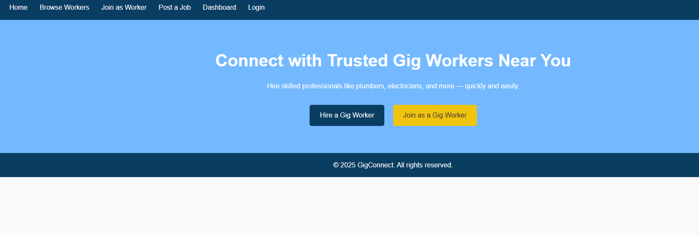

# GigConnect

**GigConnect** is a web platform that connects users with trusted local gig workers such as plumbers, electricians, masons, shop helpers, and more. It enables users to easily find and hire workers based on location and skill, while also allowing workers to register and receive job opportunities.




---

## 🚀 Features

- 📍 Find and hire gig workers near your area
- 🧑‍🔧 Worker signup and job listings
- 🔐 Secure login system
- 🗂️ Dashboard for workers and job posters
- 🔎 Filter/search workers based on profession or area
- 📱 Mobile-friendly responsive UI

---

## 🛠️ Tech Stack

- **Frontend**: HTML, CSS, JavaScript
- **Backend**: Python, Flask
- **Templating**: Jinja2 (Flask templates)
- **Styling**: Custom CSS
- **Database**: SQLite (or any Flask-supported DB)

---

## 📁 Project Structure

```bash
GigConnect/
├── static/
│   ├── css/
│   ├── js/
│   └── images/
├── templates/
│   ├── index.html
│   ├── login.html
│   ├── dashboard.html
│   └── register.html
├── app.py
├── requirements.txt
├── README.md
└── .gitignore
```

---

## 🔧 How to Run Locally

### 1. Clone the Repository
```bash
git clone https://github.com/your-username/GigConnect.git
cd GigConnect
```

### 2. Create a Virtual Environment
```bash
python -m venv venv
source venv/bin/activate      # On Windows use: venv\Scripts\activate
```

### 3. Install Dependencies
```bash
pip install -r requirements.txt
```

### 4. Run the Flask App
```bash
python app.py
```

### 5. Open in Browser
Visit: `http://127.0.0.1:5000`

---

---

## 🧑‍💻 Contributing

Pull requests are welcome. For major changes, please open an issue first to discuss what you would like to change.

---

## 📄 License

This project is licensed under the MIT License. See the [LICENSE](LICENSE) file for details.

---

## 🙌 Acknowledgements

Special thanks to all contributors and supporters of this project. Inspired by local gig needs.
